# How to Install Git and Visual Studio Code: A Beginner’s Guide

## Introduction

Have you ever wanted to keep track of changes to your files or write and test
code easily? Two powerful tools, **Git** and **Visual Studio Code (VS Code)**,
can help you do exactly that—and more! Whether you're working on a personal
project, collaborating with others, or just exploring the world of coding,
these tools are essential for getting started.

Think of **Git** as a "time machine" for your files. It allows you to save
snapshots of your work, so you can always go back to a previous version if
something goes wrong. It’s especially useful when working on team projects, as
it helps everyone stay organized and avoid conflicts.

**Visual Studio Code (VS Code)**, on the other hand, is like a supercharged text
editor. It’s designed to make writing and editing code easier, with features
like syntax highlighting, auto-completion, and built-in tools for debugging.
Whether you're writing a simple script or building a complex application, VS
Code provides a comfortable and efficient workspace.

Together, Git and VS Code are a dynamic duo for anyone working with code. This
guide will walk you through the simple steps to install both tools on your
computer. No prior experience is needed—just follow along, and you’ll be ready
to start using these tools in no time!

## 2. Installing Git

In this section, we’ll walk through the process of installing Git on a Windows
computer. Don’t worry—it’s straightforward, and I’ll guide you through every
step.

### Step 1: Download Git

1. Open your web browser and go to the official Git website:
   [https://git-scm.com](https://git-scm.com/).

2. Click the **Download for Windows** button. The website will automatically
   detect your operating system and provide the correct version.

   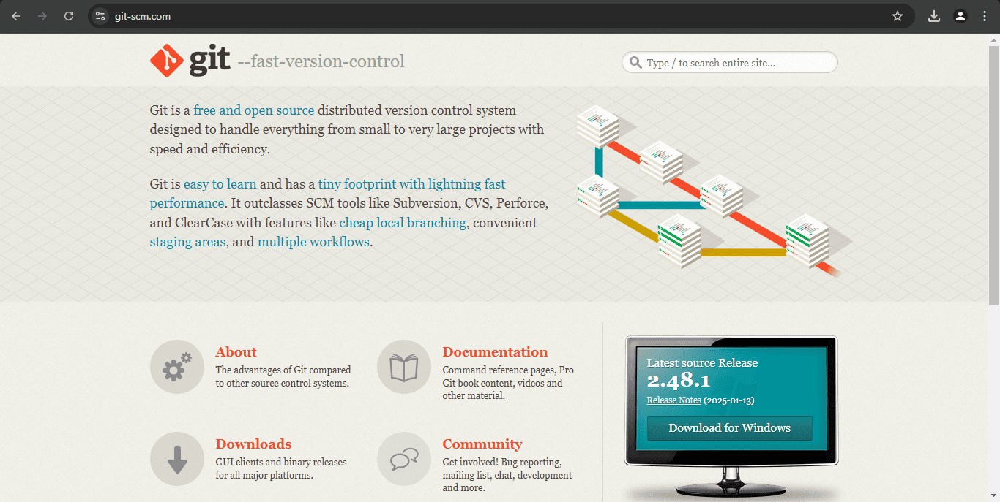  
   _Git's Homepage_

### Step 2: Run the Installer

1. Once the download is complete, locate the installer file (usually in your
   `Downloads` folder) and double-click it to run the installer.

2. A security warning may pop up. Click **Yes** to allow the installer to make
   changes to your device.

### **Step 3: Follow the Installation Wizard**

1. The Git Setup Wizard will open. Click **Next** to begin the installation.

   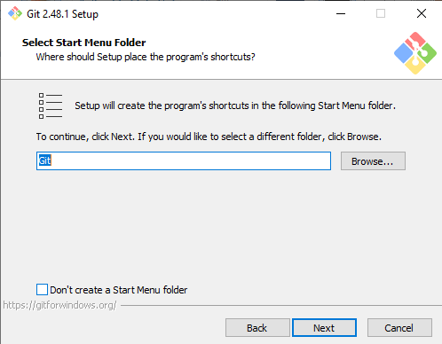  
   _Git Setup Wizard_

2. **Select Components**: On the next screen, you’ll see options for additional
   components. The default selections are fine for most users, but you can
   customize them if you’d like. Click **Next** to continue.

   _(Insert screenshot of the "Select Components" screen here.)_

3. **Choose the Default Editor**: Git needs a text editor for certain tasks. By
   default, it suggests **Vim**, but if you’re not familiar with Vim, you can
   select **Notepad** or another editor you’re comfortable with but I recommend
   **Visual Studio Code** because I would show how to use it in this guide.
   Click **Next**.

   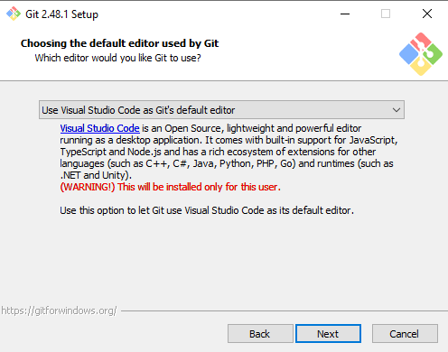  
    _Git Default Editor_

4. **Choose Initial Branch Name**: During the old times, the default was
   **master** but in recent times **main** has been the preferred option. So,
   select **Override default branch name for new repositories** and input
   **main** as the default. Click **Next**.

   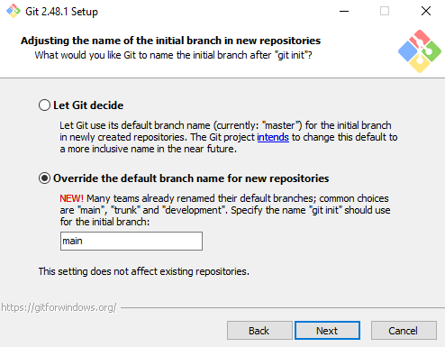

5. **Adjust Your PATH Environment**: This step determines how Git is accessed
   from the command line. Select the recommended option:
   **Git from the command line and also from 3rd-party software**. This ensures
   Git works seamlessly with tools like VS Code. Click **Next**.

   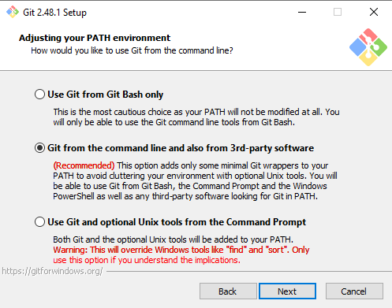

6. **Choose SSH Executable**: Select **Use Bundled OpenSSH**. Click **Next**.

   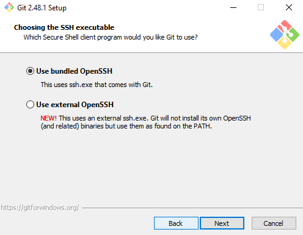

7. **Choose HTTPS Transport Backend**: Leave this setting at its default
   (**Use the OpenSSL library**) and click **Next**.

   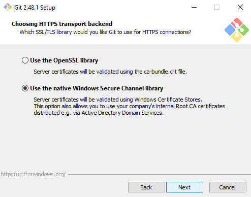

8. **Configure Line Ending Conversions**: This setting ensures compatibility
   between Windows and other operating systems. Select the default option:
   **Checkout Windows-style, commit Unix-style line endings**. Click **Next**.

   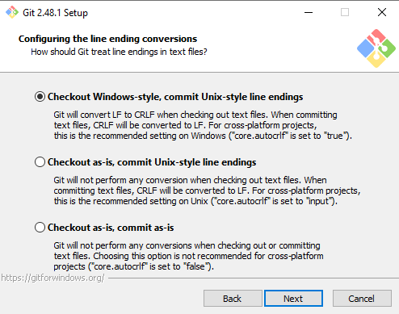

9. **Choose Terminal Emulator**: Select
   **Use MinTTY (the default terminal of MSYS2)** for a better terminal
   experience. Click **Next**.

   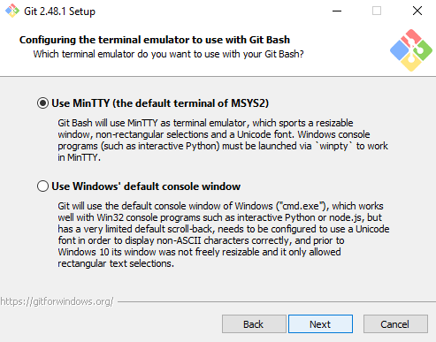

10. **Choose Git Pull Default Behavior**: Several options to pick from here but
   for beginners and non-technical people, picking **Fast Forward or Merge** is
   the best option. Click **Next**.

      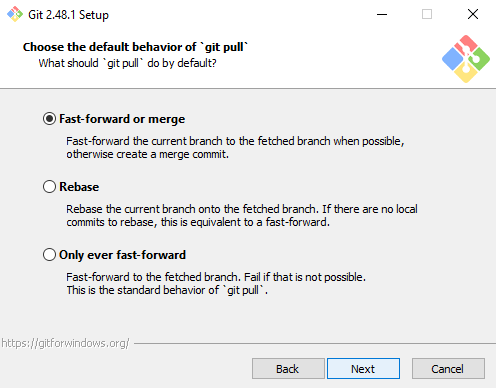

11. **Choose Credential Helper**: Select **Git Credential Manager**. Click
    **Next**.

      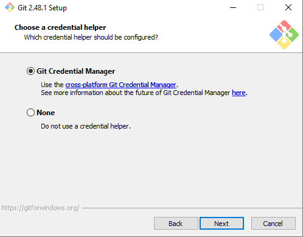

12. **Configure Extra Options**: Leave the default options selected and click
    **Install**.

      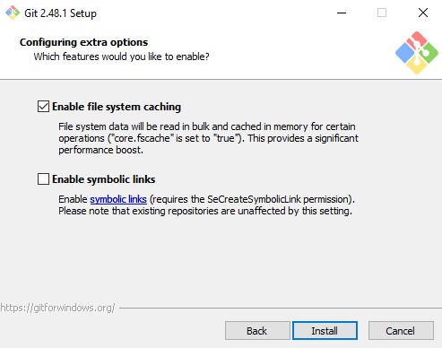

The installer will now install Git on your computer. This may take a few
moments.

### **What’s Next?**

Congratulations! You’ve successfully installed Git on your Windows computer.
In the next section, we’ll install Visual Studio Code and set it up to work
seamlessly with Git.

### 3. Open a GitHub Account

Before we move on to installing Visual Studio Code, it’s a good idea to set up
a **GitHub account**. GitHub is a platform that works seamlessly with Git,
allowing you to store your code online, collaborate with others, and contribute
to projects.

#### Steps to Create a GitHub Account

1. Go to [https://github.com](https://github.com) and click **Sign up**.

2. Enter a username, your email address, and a secure password.

3. Verify your email address by clicking the link in the confirmation email sent
   by GitHub.

#### Why Set Up GitHub Now?

Once you’ve installed Visual Studio Code, you’ll be able to connect it to
GitHub, making it easy to save and share your projects. Having a GitHub account
ready will save you time later!

Now that your GitHub account is set up, let’s install **Visual Studio Code**
and get everything connected.
